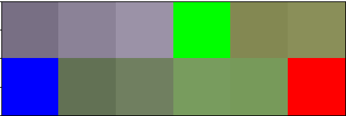
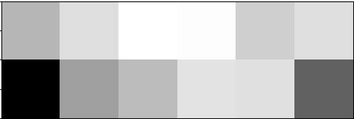

# Zooming Images — Findings

## Coordinate system mismatch: NumPy vs PIL

NumPy arrays and PIL images describe dimensions in the opposite order:

```python
arr = ft_load("animal.jpeg")
print("arr ", arr.shape)  # (768, 1024, 3)  → (height, width, channels)
im  = Image.fromarray(arr)
print("img ", im.size)    # (1024, 768)      → (width, height)
```

PIL uses a **Cartesian** coordinate system — `(x, y)` — with `(0, 0)` at the
upper-left corner. NumPy uses **matrix** order — `(row, col)` — which maps to
`(y, x)`. Swapping the two is one of the most common bugs in image processing
code.

PIL rectangles are `(x1, y1, x2, y2)` — upper-left corner first.
`ValueError` is raised if `x2 < x1` or `y2 < y1`.

---

## crop / resize / zoom — what each operation does

| Operation | What changes | What stays the same |
|-----------|--------------|---------------------|
| `crop(box)` | spatial region selected | pixel values, resolution |
| `resize((w, h))` | output dimensions | spatial region |
| zoom | ROI selected **and** upscaled to original canvas | apparent resolution |

A **zoom** is the expression of a region of interest at the original image's
size. If the ROI's aspect ratio differs from the image's aspect ratio, zooming
distorts the image. Providing a **centre point and a factor** avoids this:
factor > 1 zooms in, factor < 1 zooms out.

In NumPy the crop step is pure array slicing:

```python
arr_cropped = image[u:d, l:r]   # multi-axis slice: rows then columns
```

The PIL equivalent is:

```python
Image.fromarray(image).crop((l, u, r, d))
```

Both select the same rectangle; the difference is whether you stay in NumPy or
move to PIL.

---

## Python chained comparisons

Python lets you chain comparison operators the way you would write them in
mathematics:

```python
# These are equivalent
0 <= x and x < 10
0 <= x < 10
```

Each intermediate value is evaluated **only once**, and it short-circuits like
`and` — if any comparison is `False` the rest are skipped:

```python
# f() is called once, not twice
a < f() < b

# equivalent to:
_tmp = f()
a < _tmp and _tmp < b
```

This is used in `roi_ok` to validate that a centre point lies inside the image:

```python
return 0 <= center[0] <= im.shape[1] and 0 <= center[1] <= im.shape[0]
```

---

## Grayscale conversion — `convert("L")`

`"L"` stands for **Luminance** — the perceived brightness of a pixel,
independent of colour. PIL computes it with a weighted formula based on human
perception (ITU-R BT.601):

```
L = 0.299 × R + 0.587 × G + 0.114 × B
```

Green gets the highest weight because the human eye is most sensitive to it,
red is next, blue is least.

`convert("L")` **collapses the channel dimension** — the output array is 2D,
not 3D:

```python
arr.shape        # (2, 6, 3)
gray = np.array(Image.fromarray(arr).convert("L"))
gray.shape       # (2, 6)          ← channel dimension gone
```

When the subject requires a 3D array `(height, width, 1)`, add the missing axis
explicitly with `np.newaxis`:

```python
gray_3d = gray[:, :, np.newaxis]   # shape (2, 6, 1)
```

---

## matplotlib colormap trap — always pass `cmap='gray'`

`plt.imshow()` on a 2D (single-channel) array applies its **default colormap —
viridis** — mapping low values to purple and high values to yellow-green. This
produces a misleading colour image even though the data is grayscale.

Fix: always pass `cmap='gray'` explicitly when showing grayscale data:

```python
plt.imshow(zoomed, cmap='gray', extent=(0, z_wid, z_hei, 0))
```
| Without cmap ==> 'viridis'  | With cmap                 |
|:---------------------------:|:-------------------------:|
|||

When the grayscale `"L"` image is instead pasted onto an **RGBA canvas**, PIL
automatically converts it to RGBA with `R == G == B == gray_value`. matplotlib
then receives a 4-channel image and uses the actual pixel values — all channels
equal — so the result is correctly gray without needing `cmap='gray'`.

---

## Two approaches to drawing axes

### matplotlib approach (`zoom_PIL`)

`plt.imshow()` draws axes with pixel-coordinate labels automatically. To make
the axes reflect the **zoomed region's coordinates** (not the canvas size),
pass the `extent` argument:

```python
plt.imshow(zoomed, cmap='gray', extent=(0, z_wid, z_hei, 0))
# extent=(left, right, bottom, top) in data coordinates
```

Note: PIL's `(0, 0)` is top-left; matplotlib's default puts `(0, 0)` at
bottom-left. Inverting bottom/top in `extent` corrects this.

### Manual canvas approach (`zoom_42`)

`Image.new("RGBA", (wid + margin, hei + margin), (255, 255, 255, 255))` creates
a white background larger than the original. A drawing layer is added with
`ImageDraw.Draw(canvas)`, then axes, tick marks, and labels are drawn
manually with `draw.line()` and `draw.text()` before the zoomed image is pasted
onto the canvas with `canvas.paste(zoomed, (margin, 0))`.

This approach "reinvents the wheel" compared to matplotlib, but exercises PIL
canvas composition directly.


[return](../../README.md)
